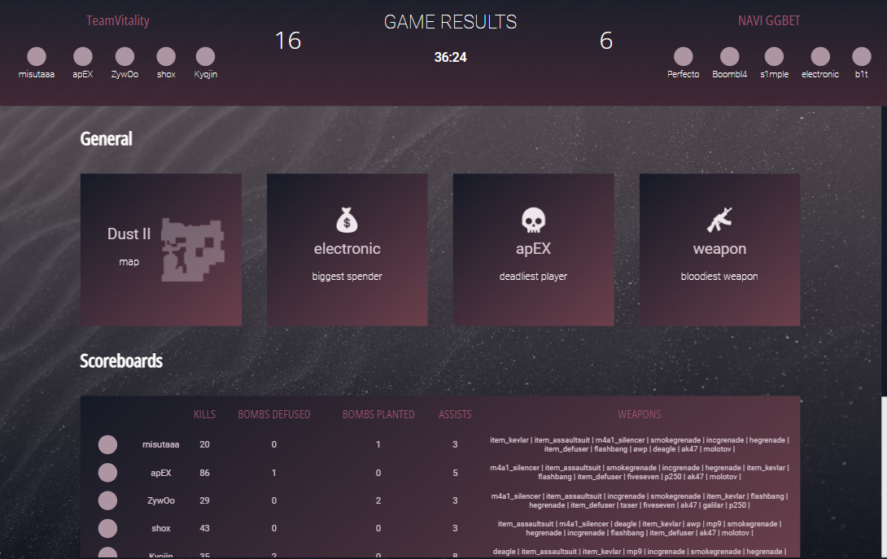

# Scope

The focus of this code repository is data processing and manipulation. There could be many different ways to improve the UI, generate statistics, however I have placed a greater emphasis on showcasing the method rather than having a full solution.

## Installation

In order to get started run `yarn install` at the root of the repository.

In order to process the `game.txt` run `yarn start` which ensures the latest build is available. Afterwards `cd` into `server\build` and run `node cli.js`.

### Stats object structure

```
{
    initTeamCT: string[],
    initTeamT: string[],
    initTeams: {
        CT: string, 
        T: string
    },
    rounds: [
        {
            date: string,
            score: string,
            roundsPlayed: number,
            reasonWin: string
        }
    ],
    userStatsMain: {
        playerUsername: {
            assistedKilling: {
                playerUsernameAssistKilled: {
                    times: number
                } 
            },
            attacked: {
                playerUsernameAttacked: {
                    times: number,
                    with: [
                        {
                            weapon: string,
                            damage: number,
                            hitgroup string
                        }
                    ]
                }
            },
            bombsDefused: number,
            bombsPlanted: number
            killed: {
                playerUsernameKilled: {
                    headshots: number,
                    times: number,
                    weapons: string[]
                }
            },
            moneySpent: number,
            moneyWon: number,
            weapons: {
                weaponName: number
            }
        }
    }
}
```

### Looks

